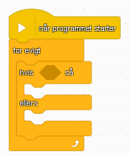
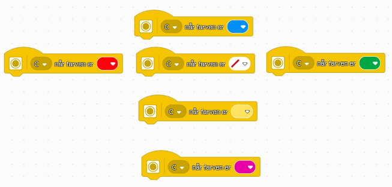

# LEGO ROBOT SPACE ACADEMY

Byg en robot med tre hjul sat på en hub (robottens krop): 2 motorer og 1 drejehjul - ligesome denne:

Forbind frihjulet til hubben:

Forbind hjulet til motoren:

Forbind motoren til hubben:

### Så er du klar!

#### Forbind motorerne til stik A og B

Forbind til robotten med bluetooth eller usb kabel.

Tryk på tilslut og følg guiden. Virker bluetooth ikke, skal du vælge "Tilslut med USB-kabel":

Når du får dette vindue op skal du vælge hubben (1) og klikke på den røde knap (2):

Hvis du ikke kan forbinde, så prøv at tænde og slukke hubben: hold knappen nede indtil den slukker (den siger 4 dut og duttelut og slukker display)

### Færdig!

Når du er forbundet ser det sådan her ud i toppen af vinduet:

# Brug kategori lyserød/bevægelse

I løbet af 3 opgaver skal I mestre bevægelses blokkene. I skal programmere robotten til at køre lige ud, dreje 90 grader og køre rundt i firkant og endelig køre rundt i en cirkel.

## Opgave 1: bevæg i en lige linje

Under beægelse skal du bruge, disse tre blokke for at få robotten til at køre i en lige linje:

#### Husk at skifte fra omdrejninger til cm!

#### Jo hurtigere robotten kører jo mere upræcis - start med 30% eller langsommere!

Sæt dem efter blokken "når programmet starter", med blokken "bevæg [tal] omdrejninger" til sidst:

Du starter programmet ved at trykke på pilen i nederste højre hjørne:

## Opgave 2: bevæg præcist så meget som pappet

Få nu robotten til at bevæge sig præcist så langt som pappet fra kassen:

Hvor mange cm skal den køre?

### Antal cm, kort side: ________

## Opgave 3: bevæg i 90 graders sving

Du skal have robotten til at bevæge sig rundt på pappet, som vist her:

Under bevægelse skal du bruge "bevæg [retning] [50] [omdrejninger]":

* Du kan vælge hvor skarpt den skal dreje med det første tal: **vælg 50**
* Det andet tal bestemmer hvor mange omdrejninger motoren skal tage

### Du skal finde ud af hvor mange omdrejninger motoren skal tage for at dreje robotten 90°,180°,270°,360° grader: hint (1) brug kommatal (2) papir og blyant til at måle hvor meget robotten har drejet!

### ANTAL OMDREJNINGER 90°: _______

### ANTAL OMDREJNINGER 180°: _______

### ANTAL OMDREJNINGER 270°: _______

### ANTAL OMDREJNINGER 360°: _______

Lav nu et program så robotten kører frem drejer 90 grader og kører frem.

## Opgave 4: bevæg i en firkant

* Få nu robotten til at lave to 90° sving, hvor den kører lige imellem, så den kører i en firkant og ender samme sted som den startede:

I vil måske få brug for at justere hvor mange omgange motorens skal tage for at lave et 90 graders sving. Noter tallet når I har fundet ud af hvor amnge omdrejninger præcist er 90°!

## Opgave 5: bevæg i en cirkel

* Få robotten til at køre rundt i en cirkel, så den stopper det sted den startede. Find ud af hvor mange omdrejninger den skal køre.

Brug "bevæg [højre] [20] [omdrejninger]".

* Du kan vælge hvor skarpt den skal dreje med det første tal: **vælg 20**
* Det andet tal bestemmer hvor mange omdrejninger motoren skal tage

### ANTAL OMDREJNINGER: _______

Skift nu hvor skarpt robotten drejer til **100**. Hvor mange omgange kører den?

### ANTAL omgange: _______

# Eksempel: skraber & klo

# EKSTRA: Sensor (LYSEBLÅ)

## Opgave 6: ultralyd-sensor

Tilslut ultralydsensoren i port **D**.

Ultralyd sensoren virker ved at udsende en lyd med den ene side og modtage den med den anden. Den kan måle mellem 4cm og 200cm. Når den er tilsluttet kan den ses under status:

Prøv at stil robotten og se hvordan tallet ændrer sig når du holder en hånd foran sensoren!

### Nb. Måler den afstanden lige så godt hvis du holder hånden skævt i forhold til sensoren?

Du skal nu lave et lille program der kan få robotten til at køre hen til en væg, og ikke røre ved den.

Når robotten skal køre hen til væggen skal den vide hvor langt der er. Det kan du gøre ved at trække "afstand til" blokken ind i en bevægelsesblok, sådan her:

##### Nb. skift fra % til cm!

Nogle gange vil du opleve at robotten kører ind i kassen.

For at undgå at robotten kører ind i kassen trækker vi lidt fra. Du finde matematik under den grønne OPERATORER, vi skal lave et minusstykke. I skal finde ud af hvor meget I skal trække fra.

#### Nb. Når I indsætter den lyseblå i den grønne er det ikonet for ultralyd-sensoren der skal ramme ind i den tomme plads i minusstykket!

Det færdige program ser sådan her ud. Find ud af hvor meget I skal trække fra!

# Selvkørende robot med ultralyd

## Opgave 7: motorstyring - kør lige

For at lave en selvkørende robot skal I have styr på at styre motorerne direkte. Lav et program hvor I kører med motorerne A og B i 2 sekunder, så robotten kører i en lige linje. Brug disse blokke:

Start med blokken "Sæt hastighed til [procent]" og afslut med de to blokke "vent 2 sekunder" og "a+b stop motor". Vent blokken finder du under kontrol.

For at vælge flere motorer til at stoppe skal du trykke på A og vælge flere. Derefter kan du vælge 1 eller flere motorer:

Programmet skrevet med almindelige ord er sådan:

* A+B Sæt hastighed til 35%
* A Start motor, retning venstre
* B Start motor, retning højre
* Vent 2 sekunder
* A+B stop motor

## Opgave 8: motorstyring - lav et sving

Når robotten har kørt i 2 sekunder skal den dreje og køre i en anden retning.

Når begge motorer kører i samme retning drejer robotten.

Med samme blokke som sidste opgave lave nu følgende program med blokke til at styre robotten:

* A+B Sæt hastighed til 35%
* A Start motor, retning venstre
* B Start motor, retning højre
* Vent 2 sekunder
* A Start motor, retning venstre
* B start motor, retning venstre
* Vent 0.5 sekunder
* A+B stop motor

## Opgave 9: robot der ikke kører ind i noget

Programmer nu robotten til at køre rundt uden at støde ind i noget. Brug ultralydsensoren til at tjekke om der er noget tæt på.

Programmet skal gøre sådan:

* Kør fremad
* Gentag følgende 3 linjer for evigt:
* Hvis der er noget indenfor afstand
* Så skal du køre lidt tilbage og dreje
* Fortsæt med at køre fremd

Du skal bruge følgende blokke for at programmere robotten:

Programmets kontrol-blokke skal stilles sådan op:

Skriver vi koden med ord ser det sådan ud:

* A+B Sæt hastighed til 35%
* A Start motor, retning: venstre
* B Start motor, retning: højre
* For evigt:
  - hvis <D er tættere på end **tal** cm> så
    + A Start motor, retning: venstre
    + B Start motor, retning: højre
    + vent 2 sekunder
    + A Start motor, retning: venstre
    + B Start motor, retning: venstre
    + vent 1 sekund
  - ellers:
    + A Start motor, retning: venstre
    + B Start motor, retning: højre

## Opgave 10: mere tilfældighed!

Prøv nu at ændre hvordan den gør ved at sætte tilfældige tal ind i ventetider. Den første blok under GRØN/ OPERATORER hedder "vælg tilfældigt tal mellem TAL og TAL":

## Opgave 11: endnu mere tilfældighed :-)

Kan du gøre det tilfældigt om den drejer til den ene eller den anden side - bliv inspireret af følgende kode skrevet med ord:

* hvis tilfældigt tal mellem 0 og 1 er lig med 1, så:
  - drej den ene vej
* ellers
  - drej den anden vej

Brug disse blokke:

## Opgave 12: styr robotten med farvesensoren

Nu er du ved at være sej programmør. Kan du styre robotten med farver?

Når du tilslutter farvesensoren til robotten kan du oprette hændelser til hver farve den ser. Kan du få sådan en fjernsytring til at virke?

Brug f.eks. disse blokke til at køre frem, tilbage, venstre, højre og langsomt når der ikke er en farve:

#### Det kan være en ide at robotten kører langsomt når den ikke ser nogen farver - f.eks. med motorhastighed 10-20%
