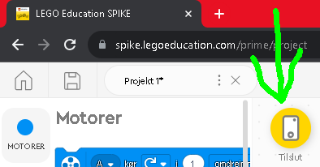
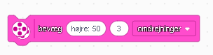
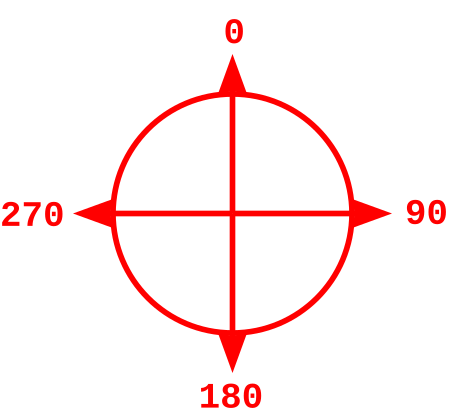
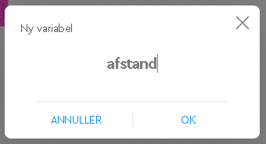
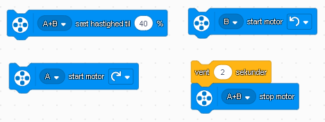
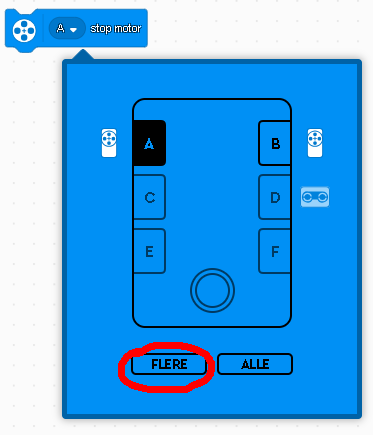

# LEGO spike robotter

Byg en robot med tre hjul: 2 motorer og 1 drejehjul.

## Indsæt billeder af dele!

Kig evt. efter min for inspiration

#### Forbind motorerne til stik A og B

Forbind til robotten med bluetooth eller usb kabel.

Tryk på tilslut og følg guiden. Virker bluetooth ikke, skal du vælge "Tilslut med USB-kabel":

# Brug Bevægelse (PINK)

I løbet af 3 opgaver skal I mestre bevægelses blokkene. I skal programmere robotten til at køre lige ud, dreje 90 grader og køre rundt i firkant og endelig køre rundt i en cirkel.

## Opgave 1: bevæg i en lige linje
Under beægelse skal du bruge, disse tre blokke for at få robotten til at køre i en lige linje:
 

Sæt dem efter blokken "når programmet starter", med blokken "bevæg [tal] omdrejninger" til sidst:

## Opgave 2: bevæg i 90 graders sving

Du skal have robotten til at bevæge sig i en lige linje. Dreje 90 grader og bevæge sig i en lige linje:

Under bevægelse skal du bruge "bevæg [retning] [50] [omdrejninger]":

* Du kan vælge hvor skarpt den skal dreje med det første tal: **vælg 50**
* Det andet tal bestemmer hvor mange omdrejninger motoren skal tage

### Du skal finde ud af hvor mange omdrejninger motoren skal tage for at dreje robotten 90°,180°,270°,360° grader: hint - brug kommatal, papir og blyant til at måle hvor meget robotten har drejet!

### ANTAL OMDREJNINGER 90°: _______
### ANTAL OMDREJNINGER 180°: _______
### ANTAL OMDREJNINGER 270°: _______
### ANTAL OMDREJNINGER 360°: _______

Lav nu et program så robotten kører frem drejer 90 grader og kører frem.

## Opgave 3: bevæg i en firkant

* Få nu robotten til at lave to 90 graders sving, hvor den kører lige imellem, så den kører i en firkant og ender samme sted som den startede.

I vil måske få brug for at justere hvor mange omgange motorens skal tage for at lave et 90 graders sving.

## Opgave 4: bevæg i en cirkel

* Få robotten til at køre rundt i en cirkel, så den stopper det sted den startede. Find ud af hvor mange omdrejninger den skal køre.

Brug "bevæg [højre] [20] [omdrejninger]".

* Du kan vælge hvor skarpt den skal dreje med det første tal: **vælg 20**
* Det andet tal bestemmer hvor mange omdrejninger motoren skal tage

### ANTAL OMDREJNINGER: _______

# Sensor (LYSEBLÅ)

## Opgave 4: ultralyd-sensor

Tilslut ultralydsensoren i port D. Nu kan du måle afstande!

Den kan måle op til 200cm.

Du skal nu lave et lille program der kan få robotten til at køre hen til en væg, og ikke støde ind i den.

Det første vi skal gøre er at gemme hvor langt der er hen til det som står foran robotten.

Det gør vi ved at:

1. Lav en variabel der hedder astand

2. Kald variablen afstand

3. Træk "Sæt asfatnd til" ind under blokken "når programmet startes":

4. Sæt variablen til at være input fra ultralyd-sensoren i cm. Du finder input fra ultralydsensoren under de lyseblå blokke:

4. Det skal se sådan ud når du har ændret fra % til cm:

5. Nu sætter vi robotten til at køre helt hen til væggen, den orange "afstand" finder du under variabler:

6. For at undgå at robotten kører ind i væggen trækker vi lidt fra - skal vi sige 10cm? Du finder den grønne minusblok under operatorer. Sæt afstand til venstre og skriv 10 til højre, sådan her:

# Motorstyring (BLÅ)

## Opgave 5: kør lige linje IGEN :-)

Nu skal I styre motorerne direkte.

Brug følgende blokke til at få robotten til at køre i en lige linje. Start med blokken "Sæt hastighed til [procent]" og afslut med de to blokke "vent 2 sekunder" og "a+b stop motor". Vent blokken finder du under kontrol.

For at vælge flere skal du trykke på A og vælge flere. Derefter kan du vælge 1 eller flere motorer:

